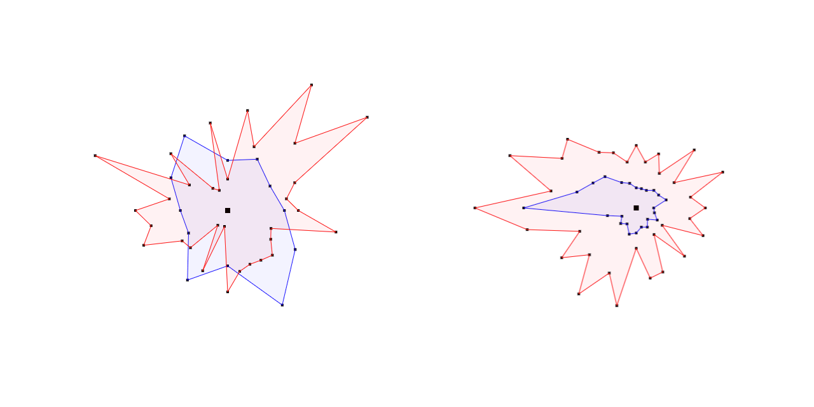

# Polygon Generator – Canvas

- [About](#about)
- [Todo](#todo)

---

## About

Generates random polygons from a circular base shape. Variants show a rather spiky vs. flat design.

Intended to be used with game engines to create random landscapes or elements. Alternative use cases imaginable: Graphic design, convert to vector export file.

## Todo

- Add UI to configure generator parameters
- Allow SVG export of shapes (challenge: coordinate systems)
